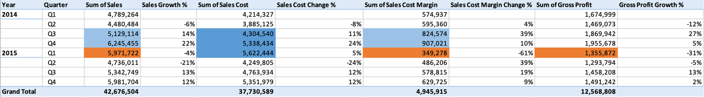
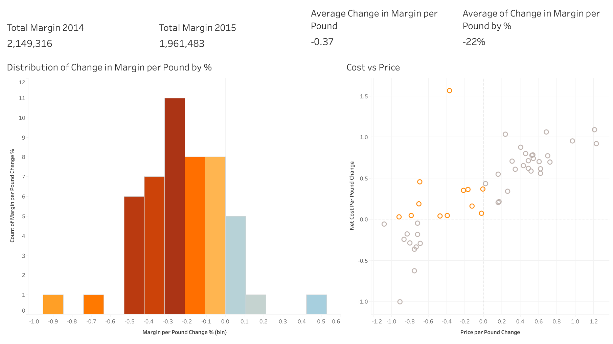
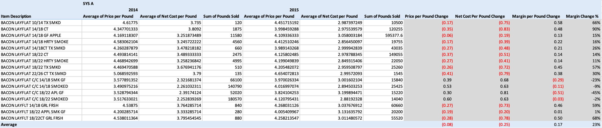
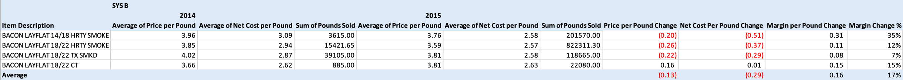
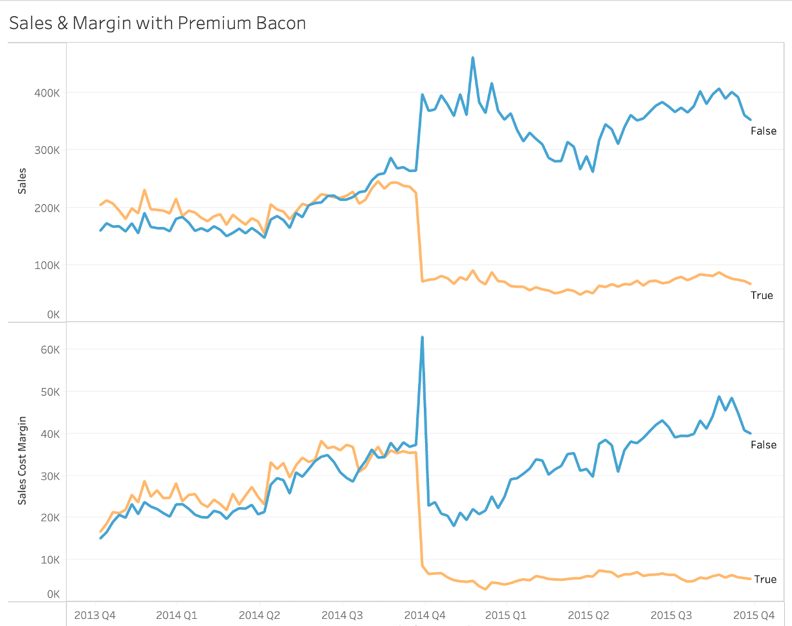
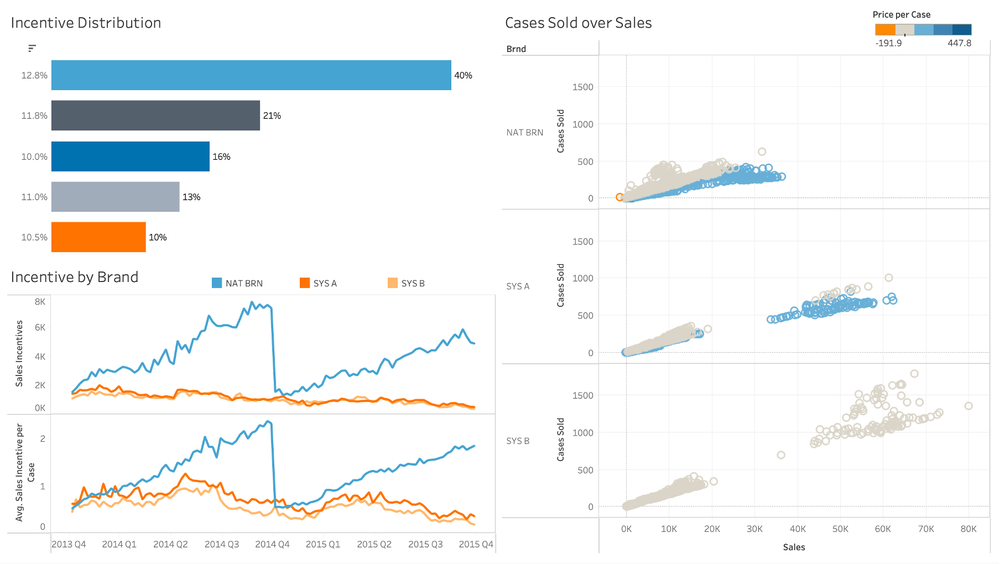
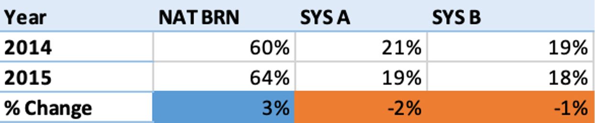
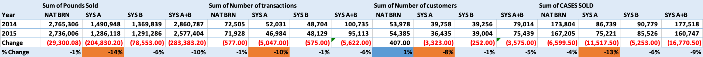
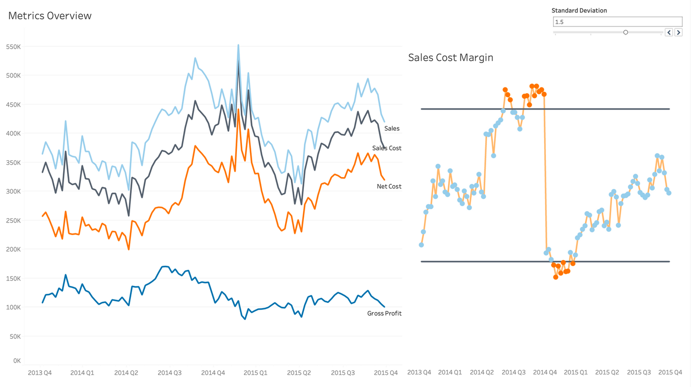

# Bacon Margin Analysis
This is a demo project analyzing factors related to the decrease in bacon sales cost margin for Sysco, one of the most famous food distribution company.

## Project Background

Bacon, a popular item for many of Sysco customers, has seen sales increasing from ~20.1M to ~22.6M year over year. Sysco carries several leading National Brands as well as two private label tiers, SYS A and SYS B. While the national brands are well known and loved by the customers, the two private label  product lines offer great quality for an advantageous price for customers and profitability for Sysco. 

Upon reviewing a routine margin performance report the RevMan analyst has uncovered that while the Sales have grown year over year, the margins for the Bacon Category have been shrinking.

With the following analysis, we will dive into the problem with four sections: an overview of trends and insights; a root cause analysis especially with pricing and cost, product mix, and sales incentive; a specific analysis regarding private label tier; and recommendation and next steps.

## Executive Summary
From 2014 to 2015, there're three quarters of performance worth our attention--Q3 2014, Q4 2014, and Q1 2015. There's continuously increasing sales cost, and increase in sales and sales cost margin in the first two quarters of the three. However, in Q1 2015, the sales cost margin has declined by 61% ($557743) in total.

Factors contributing to the issue include: margin per pound for roughly a quarter of the national brand products has shrinked, leading to on average 22% decline in margin per pound from 2014 to 2015; possible shift in customer preference from high margin products to lower margin products; finally, inappropriate balance between volume growth and profit margin determined by sales representatives. Further cost managment, more strategic pricing system, and more considerate sales incentive grid will be helpful for solving the existing problem. 

## Insights Deep-Dive
### Cost & Pricing
**National Brand**

- Less than half of the national brand products have experience price (per pound) dropped from 2014 to 2015.
- Half of the price-dropped products also had increase in net cost per pound (see the orange data points in scatter plot above).
- Rising costs but declining prices resulted in compressed margins across multiple products.

**Private Label**

- Three quarters of the private label products have decline in price per pound and net cost per pound.
- The drop in price is not as much as net cost, leading to increase in margin per pound.
- Overall, Sys A and Sys B have increased in margin per pound by 23% and 17% respectively.

### Product Mix

- The feature Premium Bacon is defined based on whether the bacon is either gluten free or center cut, since the two types usually cost more.
- Before the fourth quarter of 2014, the premium bacon has slightly higher margin and higher sales than the non-premium.
- In Q4 2014, there's a sudden increase in margin and sales of non-premium bacon, but a sudden decrease in margin and sales of premium bacon.
- The changes in sales and sales cost margin indicate a potential shift in customer preference or other external factors influencing the market.

### Sales Incentive

- The top five tiers dominated more than 98% of transactions, where they are all less than 1000 sales per transaction. The most common tier (12.8%) refers to margin per transaction greater than 250 and sales per tranaction less than 1000.
- National brand products's incentive has fluctuated the most, especially in Q4 2014.
- Looking at the same level of sales, there are two groups of data points (blue & grey), showing different volume and price level.
- National brand products have the most obvious two groups of transactions, showing underlying problem with volume growth and margin retention.

### Private Label Tier Performance

- The metric used in the table is calculated based on the average of brand-wise quarterly margin to total quarterly margin.
- Even with the problem of decrease in margin per pound, national brand products still had a 3% growth in contribution to total margin. Meanwhile, the private label products had decrease in their contribution percentage.

- As shown in the table above, private label products indeed experienced significcant decline in volume (with pound sold, number of transactions, number of customers, and cases sold), whereas national brand products only had some single digit changes.

## Recommendations
**Sales Incentive**
- To maintain the sales cost margin, we should recover the sales volume of private label products. Therefore, I proprose to take product label into consideration while defining sales incentive. 
- Also thinking from sales person point of view, although private label products contain larger margin, more efforts would needed to persuade customers make the purchase of products with less popularity. In other words, while national brand products' margin fluctuates a lot, the purchase volume may conpensate for decreased margin. Therefore, there are few changes to the volume of national brand products. 
- In conclusion, to better boost the private tier sales, a strategy is to encourage sales person with higher incentive for private label products.

**Cost Management**
- Throughout the 8 quarters' metrics, changes in cost has been one of the leading factor contributing to the decline of margin. Without further data, we are not able to decide which side of cost, either supplier or logistics cost, influence the most. 
- In general, we could work on better sourcing and negotiation with suppliers for a better price. On ther other hand, logistics cost could be optimized through more efficient strategy of operations.

**Pricing Strategy**
- With regards to the increase in cost but decrease in price within a quarter of the national products from 2014 to 2015, more strategic pricing strategies should be applied according to the fluctuation in costs and volume changes. For example, we can conduct customer sensitivity analysis and based on the anticipation of customer behavior to decide pricing. 
- Moreover, to better balance between volume growth and margin retention, unnecessary discounting should be avoided based on customer's purchasing behavior. As mentioned before, with comprehensive understanding of customer sensitivity, we can better maximize profitability through optimizing price and sales volume.

